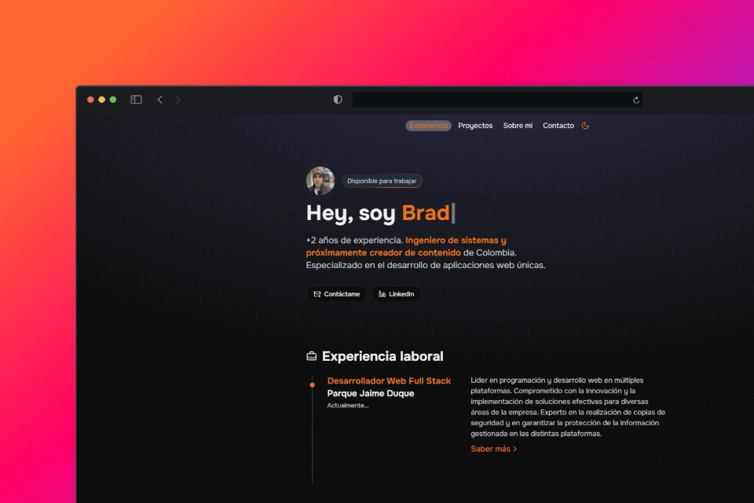

# 👨🏻‍💻 Porfolio para programadores y desarrolladores

<div align="center">
<a href="https://porfolio.dev/">

</a>
<p></p>
</div>

<div align="center">


</div>

## 🚀 Instrucciones para ejecutar el proyecto

Para ejecutar este proyecto en tu máquina local, sigue los siguientes pasos:

1. **Clona el repositorio:**
```bash
git clone https://github.com/BradMoyetones/portfolio.git
```


2. **Instala las dependencias:**
Navega a la carpeta del proyecto y ejecuta:
```bash
npm install
```

3. **Ejecuta el proyecto:**
Para iniciar el servidor de desarrollo, ejecuta:
```bash
npm run dev
```

4. **Abre tu navegador:**
Una vez que el servidor esté en ejecución, abre tu navegador y ve a `http://localhost:5173` para ver el proyecto en acción.

<p></p>